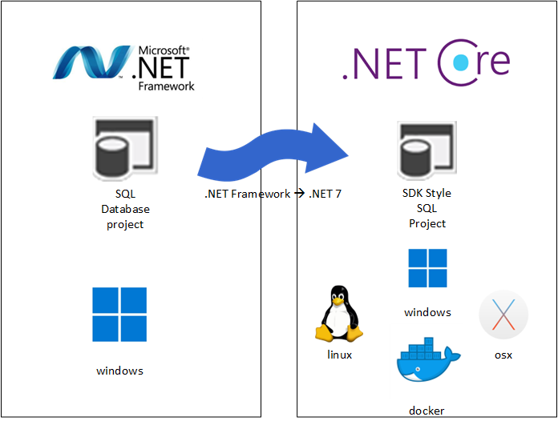

# Cross-platform SQL project with DacFx

Contains source code for database project and documentation on how to migrate from framework based project to SDK based project.
This SQL Database project can be developed, built and published from windows, linux, osx or Docker container.



## Install SQL project templates

```bash
dotnet new install Microsoft.Build.Sql.Templates
```

## Initialise new SQL project

```bash
dotnet new sqlproj -n Database.DacFx
```

> If you are planning to keep both projects for any reason, copy database objects (.sql) scripts from existing project to new project

# Add new objects (optional)

You can create new objects as plain `.sql` scripts and put it anywhere in the new project.

For example, here's `Tables/User.sql` script to create User table.

```sql
CREATE TABLE [dbo].[User](
    [UserId] [int] IDENTITY(1,1) NOT NULL PRIMARY KEY,
    [Name] [varchar](50) NOT NULL
);
```

# VS Code Tasks

VS Code tasks are configured to build database, publish database and run unit tests.

| Task | Description |
| --- | --- |
| clean database | clean bin and obj folders
| build database | build database project and produces dacpac
| publish database | uses dacpac produced from build to deploy on localhost
| Run database in docker container | builds docker image with ready to use database
| Run database unit tests in docker container | runs database unit tests using docker

## Build dacpac

```bash
dotnet build
```

## Publish

### To local database using SQLPackage

> Install SqlPackage as dotnet tool `dotnet tool install -g microsoft.sqlpackage`

```bash
sqlpackage /Action:Publish /SourceFile:"bin/Debug/Database.DacFx.dacpac" /TargetServerName:"(localdb)\MSSQLLocalDB" /TargetDatabaseName:Database.DacFx
```

### Generated SQL scripts

Another way to deploy changes to database is to copy contents of script from `bin/Debuig/Database.DacFx_Create.sql` and run it using SSMS or `sqlcmd` tool.

## Using Docker for debugging and testing in local environment

### Build Image

```bash
docker build -t todo-database .
```

### Run Image

```bash
docker run -e "ACCEPT_EULA=Y" -e "MSSQL_SA_PASSWORD=SuperSecretPassword#1" \
   -p 1433:1433 --name sql1 --hostname sql1 \
   todo-database
```

### Connect to SQL Server

- Using SSMS

  - Server: `localhost,1433`
  - Authentication method: `SQL Server Authentication`
  - User: `sa`
  - Password: `SuperSecretPassword#1`

- Connection String

  `Server=localhost,1433;Database=Database.DacFx;User=sa;Password=SuperSecretPassword#1;TrustServerCertificate=true`

### Stop and Remove container

```bash
docker rm -f sql1
```

## References

- [DacFx](https://github.com/microsoft/DacFx)

- [Quick start - MS SQL Docker](https://learn.microsoft.com/en-us/sql/linux/quickstart-install-connect-docker?view=sql-server-ver16&pivots=cs1-bash)

- [sqlcmd](https://learn.microsoft.com/en-us/sql/tools/sqlcmd/sqlcmd-use-utility?view=sql-server-ver16)

- [SSMS](https://docs.microsoft.com/en-us/sql/ssms/download-sql-server-management-studio-ssms)
